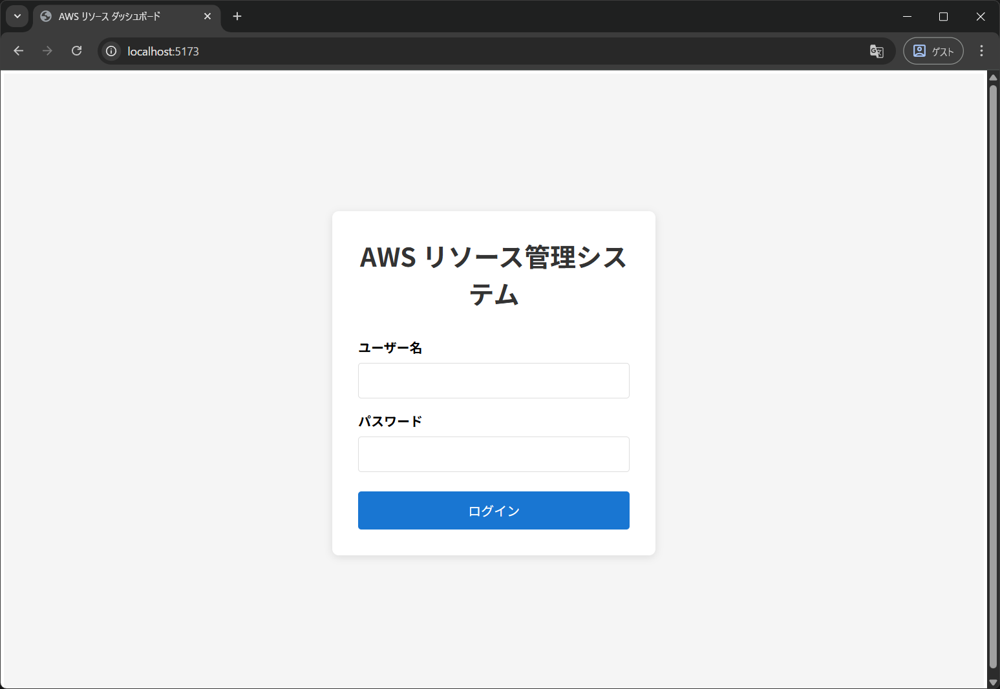
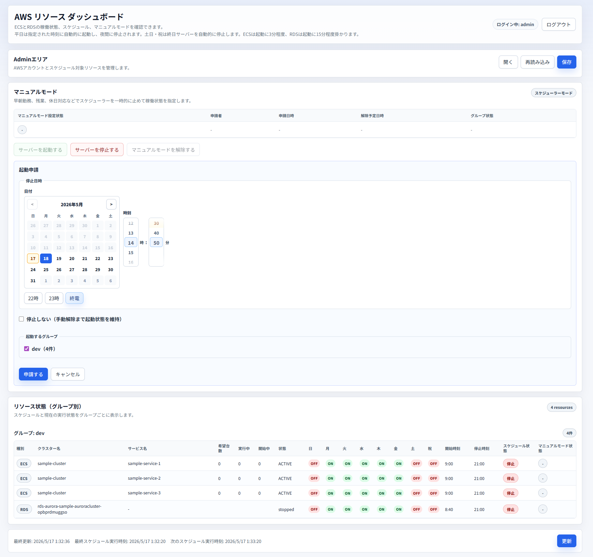

# 初回セットアップ

## 1. makeコマンドでセットアップを行う

```sh
make setup
```

## 2. 夜間、休日停止する設定を行う

下記のような設定をしたjsonファイルを app/api/data/config.json に置く。

```json
{
  "awsAccounts": [
    {
      "accountId": "dev",
      "accountName": "開発アカウント",
      "awsRegion": "ap-northeast-1"
    },
    {
      "accountId": "stg",
      "accountName": "ステージングアカウント",
      "awsRegion": "ap-northeast-1",
      "credentialProfile": "aws-sleep-stg"
    }
  ],
  "ecsItems": [
    {
      "accountId": "dev",
      "groupName": "web",
      "clusterName": "sample-cluster",
      "serviceName": "sample-service-1",
      "desiredCount": 1,
      "startDate": "9:00",
      "stopDate": "21:00"
    },
    {
      "accountId": "dev",
      "groupName": "web",
      "clusterName": "sample-cluster",
      "serviceName": "sample-service-2",
      "desiredCount": 1,
      "startDate": "9:00",
      "stopDate": "21:00"
    },
    {
      "accountId": "stg",
      "groupName": "batch",
      "clusterName": "sample-cluster",
      "serviceName": "sample-service-3",
      "desiredCount": 1,
      "startDate": "9:00",
      "stopDate": "21:00"
    }
  ],
  "rdsItems": [
    {
      "accountId": "dev",
      "groupName": "web",
      "clusterName": "rds-aurora-sample-auroracluster-zoizerqxon9k",
      "startDate": "8:40",
      "stopDate": "21:00"
    }
  ]
}
```

`awsAccounts` は必須です。各アカウントには `accountId` と `awsRegion` を指定してください。
各 `ecsItems` / `rdsItems` には `accountId` を指定してください。
`credentialProfile` を指定したアカウントはAWSプロファイルを使用します。未指定のアカウントは実行環境のAWS認証情報を使用します。

`groupName` はマニュアルモードで起動する対象を選択するためのグループです。各 `ecsItems` / `rdsItems` に必ず指定してください。マニュアルモードの起動申請では、グループごとに起動する/起動しないを選択できます。

## 動作確認

http://localhost/server-monitoring にアクセス  
初回セットアップ通りなら、初期パスワード admin と password123 でログインできます。

# **以下はメモ**

## AWS環境がない場合にテスト用の環境を作成する

ECSとRDSを夜間停止プログラムの動作確認用に作成する場合は、`app/infra` 配下のCloudFormationテンプレートを使用します。

この手順ではVPC自体は作成しません。既存のVPCとSubnetを使用します。

### 1. AWS設定ファイルを作成する

下記のような設定をしたjsonファイルを `app/script/data/aws-config.json` に置く。

```json
{
  "vpc": {
    "vpcId": "vpc-68c2fc51b7c4d6544",
    "subnets": [
      {
        "subnetId": "subnet-795543aebce143aa7"
      },
      {
        "subnetId": "subnet-26e2366fd33b96550"
      },
      {
        "subnetId": "subnet-270ff4a7887085856"
      }
    ]
  },
  "awsRegion": "ap-northeast-1",
  "awsAccountId": "123456789012"
}
```

`vpc.vpcId` には既存VPCのID、`vpc.subnets` にはECS/RDSを配置するSubnet IDを設定します。
RDS Auroraを作成するため、Subnetは複数AZに分かれているものを指定してください。

### 2. AWS認証情報を設定する

CloudFormationを実行するため、`env/script/.env` にAWSアクセスキーを設定します。

```env
AWS_ACCESS_KEY_ID=
AWS_SECRET_ACCESS_KEY=
```

APIサーバーからECS/RDSを起動停止するため、`env/api/.env` にAWSアクセスキーを設定します。

```env
AWS_ACCESS_KEY_ID=
AWS_SECRET_ACCESS_KEY=
AWS_SLEEP_JWT_SECRET=
```

`env/api/.env` のAWSユーザーには、`app/infra/api-iam-policy.json` の権限を付与してください。

### 3. ローカル環境をセットアップする

```sh
make setup
```

### 4. CloudFormationでAWSリソースを作成する

ECS用のService Linked Roleが未作成の場合だけ、先に作成します。既にAWSアカウント内に存在する場合はこのコマンドは不要です。

```sh
docker compose exec script cli deploy-cloudformation ../infra/ecs-service-linked-role.yml
```

ECSタスク実行ロール、ECRリポジトリ、ECRイメージ、ECSサンプルサービス、RDS Auroraサンプルクラスターを順番に作成します。

```sh
docker compose exec script cli deploy-cloudformation ../infra/ecs-execution-role.yml
docker compose exec script cli deploy-cloudformation ../infra/ecr-repository.yml
docker compose exec script cli push-ecr
docker compose exec script cli deploy-cloudformation ../infra/ecs-sample.yml
docker compose exec script cli deploy-cloudformation ../infra/rds-aurora-sample.yml
```

作成される主なリソースは以下です。

- ECS Cluster: `sample-cluster`
- ECS Service: `sample-service-1`, `sample-service-2`, `sample-service-3`
- ECR Repository: `nginx`
- RDS Aurora MySQL Cluster
- Secrets Manager Secret

`rds-aurora-sample.yml` は `db.t4g.medium` のAuroraインスタンスを2台作成するため、動作確認後は不要なリソースを削除してください。

### 5. 夜間停止プログラムの設定に反映する

AWSリソース作成後、`app/api/data/config.json` にECS/RDSの設定を追加します。

ECSはCloudFormationテンプレート上で固定名を使用しているため、以下の名前を指定できます。

```json
{
  "accountId": "dev",
  "groupName": "web",
  "clusterName": "sample-cluster",
  "serviceName": "sample-service-1",
  "desiredCount": 1,
  "startDate": "9:00",
  "stopDate": "21:00"
}
```

RDSのクラスター名はCloudFormationのOutputs、またはAWSコンソールのRDS画面で確認してください。

```sh
docker compose exec script aws cloudformation describe-stacks \
  --stack-name rds-aurora-sample \
  --query 'Stacks[0].Outputs'
```

このコマンドで確認した `ClusterIdentifier` を、`accountId` / `groupName` / `startDate` / `stopDate` と合わせて `app/api/data/config.json` の `rdsItems` に設定します。

### CloudFormationデプロイコマンドについて

`deploy-cloudformation` はテンプレートファイル名からスタック名を自動で決定します。
例えば `../infra/ecs-sample.yml` は `ecs-sample` スタックとして作成されます。

```sh
docker compose exec script cli deploy-cloudformation ../infra/ecs-sample.yml
```

## TODO

- ローカル環境でしか動作しないため、インターネットで操作したい
    - 管理画面用のECSを作成する
    - jsonファイルのストレージ管理なので、ECSの再起動でデータが無くなるため、DynamoDBに移動したい

## apiサーバーとのテスト通信

```sh
docker compose exec script bash -c 'curl http://api:3000/health && echo ""'
```

```
{"status":"ok","timestamp":"2025-08-30T11:22:20.115Z"}
```

## apiサーバーのテスト

```sh
docker compose exec script bash -c 'cd app/api && npm test'
```
