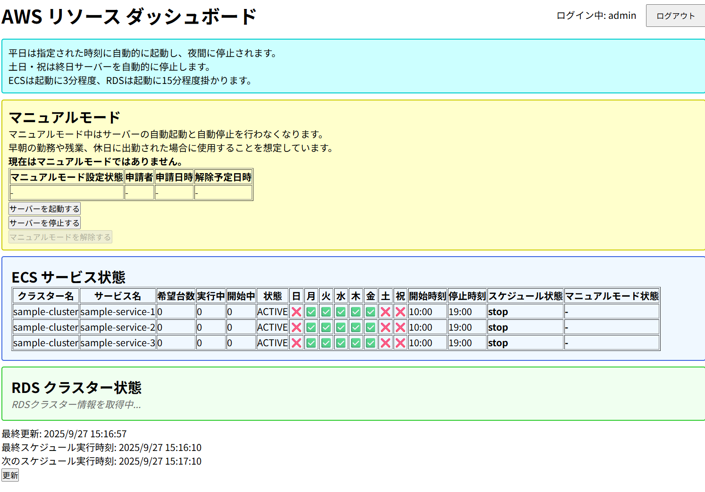

# 初回セットアップ

## 1. 【初回セットアップ】scriptコンテナのnpm install

```sh
docker compose up -d
docker compose exec script bash
cd /app/app/script
npm install
```

## 2. 【初回セットアップ】apiコンテナのnpm install

```sh
docker compose up -d
docker compose exec script bash
cd /app/app/api
npm install
```

## 3. 【初回セットアップ】webコンテナのnpm install

```sh
docker compose up -d
docker compose exec script bash
cd /app/app/web
npm install
```

## 4. 【初回セットアップ】管理者ユーザーを作成

```sh
docker compose up -d
docker compose exec script bash
cd /app/app/script
npm run dev manage-users add admin password123
```

## 5. 【初回セットアップ】AWSのIAMユーザーの作成とアクセスキーの発行

### 5.1. apiコンテナのAWSアクセスキーの設定
jenkins-iam-role.json が env/api/.env に必要なポリシーです。  
IAMユーザーを作成して、直接ポリシーをアタッチし、アクセスキーを発行して `env/api/.env` に設定してください。

### 5.2. scriptコンテナのAWSアクセスキーの設定

**テスト用のECSとRDSを作成して確認するためのものですので、実稼働する場合は不要です。**

deploy-cloudformation-iam-role.json が env/script/.env に必要なポリシーです。
IAMユーザーを作成して、直接ポリシーをアタッチし、アクセスキーを発行して `env/script/.env` に設定してください。

## 6. 【初回セットアップ】夜間、休日停止する設定を行う

```json
{
  "ecsItems": [
    {
      "clusterName": "sample-cluster",
      "serviceName": "sample-service-1",
      "startDate": "9:00",
      "stopDate": "21:00"
    },
    {
      "clusterName": "sample-cluster",
      "serviceName": "sample-service-2",
      "startDate": "9:00",
      "stopDate": "21:00"
    },
    {
      "clusterName": "sample-cluster",
      "serviceName": "sample-service-3",
      "startDate": "9:00",
      "stopDate": "21:00"
    }
  ],
  "rdsItems": [
    {
      "clusterName": "rds-aurora-sample-auroracluster-zoizerqxon9k",
      "startDate": "8:40",
      "stopDate": "21:00"
    }
  ],
  "awsRegion": "ap-northeast-1"
}
```

# 動作確認

http://localhost:5173 にアクセス  
初回セットアップ通りなら、初期パスワード admin と password123 でログインできます。

# **以下はメモ**

## TODO

- ローカル環境でしか動作しないため、インターネットで操作したい
    - 管理画面用のECSを作成する
    - jsonファイルのストレージ管理なので、ECSの再起動でデータが無くなるため、DynamoDBに移動したい

## バックエンドサーバーとのテスト通信

```sh
docker compose up -d
docker compose exec script bash
curl http://api:3000/health
```

```
{"status":"ok","timestamp":"2025-08-30T11:22:20.115Z"}
```

## バックエンドサーバーのテスト

```sh
docker compose up -d 
docker compose exec script bash
cd app/api
npm test
```

## RDSのパスワード生成コマンド

```sh
docker compose up -d 
docker compose exec script bash
cd app/script
npm run dev generate-rds-password
cp 
```

## CloudFormation デプロイ

```bash
docker compose up -d 
docker compose exec script bash
cd app/script

# 基本的な使用方法
npm run dev deploy-cloudformation ../infra/ecs-sample.yml

# スタック名を指定
npm run dev deploy-cloudformation ../infra/ecs-sample.yml ecs-sample

# VPCとサブネットを指定
npm run dev deploy-cloudformation ../infra/ecs-sample.yml ecs-sample vpc-0123456789abcdef0 subnet-1 public-subnet-2 public-subnet-3
```
